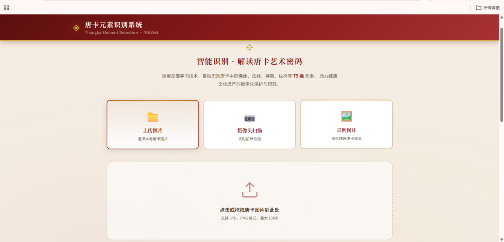
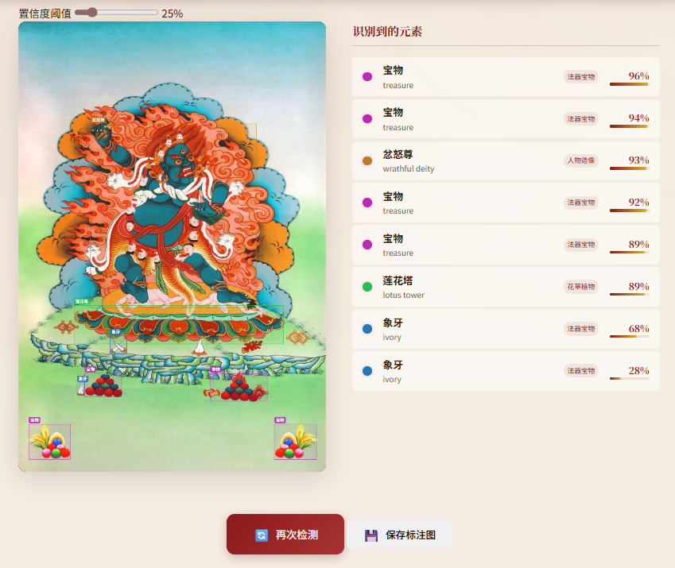
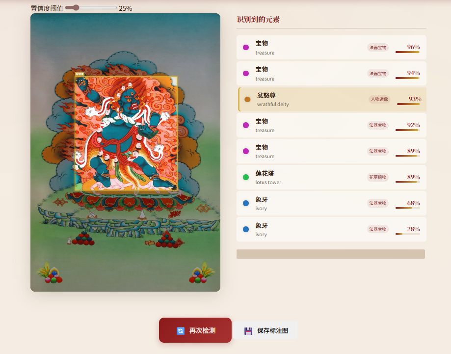

# thangka-detection

基于 **YOLOv8** 的唐卡元素智能识别系统，用于对唐卡图像中的人物、法器、神兽、纹样等视觉元素进行检测与分析。

> 这是一个聚焦 **计算机视觉 + 文化数字化** 场景的项目，目标是为唐卡图像研究、数字展示与辅助鉴定提供可运行的识别能力。

## 📌 项目简介

唐卡是藏族文化中极具代表性的绘画艺术形式，图像元素复杂、类别丰富，具有较高的文化研究与数字化价值。这个项目以 YOLOv8 为核心，围绕唐卡图像检测任务，构建了一套从 **模型训练**、**命令行推理** 到 **Web 可视化演示** 的完整流程。

当前项目主要面向以下场景：

- 唐卡视觉元素自动检测
- 文化遗产数字化展示
- 图像识别项目展示与教学演示
- 后续唐卡分析系统的算法基础模块

## ✨ 核心功能

- **多类别唐卡元素检测**：支持对唐卡图像中的多种视觉元素进行识别
- **YOLOv8 模型训练**：支持基于自定义数据集进行训练与迭代
- **命令行推理脚本**：提供基础推理与结果验证能力
- **Web 演示界面**：支持上传图片并展示检测结果
- **示例图片体验**：仓库内包含演示相关资源，便于快速体验

## 🧱 项目结构

```text
thangka-detection/
├── dataset/              # 数据集目录（训练 / 验证 / 标注）
├── runs/                 # 训练输出与实验结果
├── web/                  # Web 演示应用
│   ├── app.py            # Flask 后端入口
│   ├── templates/        # 前端模板
│   ├── static/           # 静态资源
│   └── examples/         # 示例图片
├── train.py              # 模型训练脚本
├── predict.py            # 命令行推理脚本
├── requirements.txt      # 项目依赖
├── pyproject.toml        # 当前保留的工程配置文件
└── README.md             # 项目说明
```

## ⚠️ 关于当前仓库结构的说明

这个仓库目前保留了部分训练产物、数据目录以及 YOLO 相关源码/配置，因此更接近一个“**研究型工程仓库**”而不是极简部署仓库。

这意味着：

- 仓库内容相对完整，便于复现实验流程
- 但目录体量会偏大，工程边界还可以继续整理
- 后续如果长期维护，建议进一步拆分：
  - `dataset/` 与训练产出单独管理
  - 模型权重通过 Release 或网盘方式分发
  - 将演示端与训练端进一步解耦

## 演示截图

### 唐卡元素识别系统 Demo

| 主界面 | 高亮交互 | 元素详情展示 |
| :---: | :---: | :---: |
|  |  |  |

## 🛠 技术栈

- **Python**
- **YOLOv8 / Ultralytics**
- **PyTorch**
- **Flask**
- **OpenCV / Pillow / NumPy**

## 🚀 快速开始

### 1. 克隆项目

```bash
git clone https://github.com/muyirunner/thangka-detection.git
cd thangka-detection
```

### 2. 安装依赖

```bash
python -m venv venv
source venv/bin/activate  # Windows 请改用 venv\Scriptsctivate
pip install -r requirements.txt
```

> 如果你使用 NVIDIA GPU，建议根据本机 CUDA 版本单独安装合适的 PyTorch。

### 3. 启动 Web 演示

```bash
python web/app.py
```

启动后可访问：

- `http://localhost:5000`

### 4. 训练模型（可选）

```bash
python train.py
```

### 5. 命令行推理（可选）

```bash
python predict.py
```

## 📷 演示建议

如果你后续打算把这个仓库作为更正式的代表作，建议继续补充以下内容：

- 检测效果截图
- 示例输入 / 输出对比图
- 数据集类别说明
- 模型效果指标（如 mAP、Precision、Recall）
- 模型权重获取方式

这些内容一补上，这个仓库会更像一个完整、可信的 AI 项目作品。

## 🗺 后续整理方向

- [ ] 拆分训练资源与部署资源
- [ ] 补充真实检测效果展示
- [ ] 增加数据集与类别说明文档
- [ ] 优化 Web 演示部分的说明与截图
- [ ] 整理模型权重分发方式

## 📎 Related Projects

- [thangka-full-pipeline](https://github.com/muyirunner/thangka-full-pipeline)：唐卡数字化全流程体验系统
- [muyirunner](https://github.com/muyirunner/muyirunner)：GitHub 个人主页
- [www.muyirunner.icu](http://www.muyirunner.icu)：个人网站 / 在线作品集

---

这是我当前较为核心的计算机视觉项目之一，也是在文化数字化方向上的一次实际尝试。
